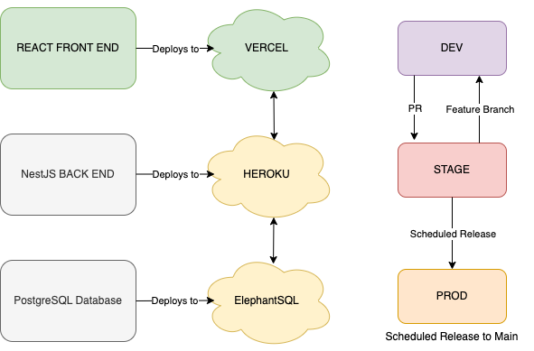

<h1>MLB Survivor Game (Front End Repo)</h1>

**Overview:**
<i>This repository contains the Client Side UI, written in React JS with Typescript, for the MLB Survivor Game.</i>

**Technologies Used:**
<h3>Client Side Technology Stack: </h3>
<li> React JS
<li> TypeScript
<li>HTML
<li>CSS
  

<h3>Branching Strategy and Deployment Listing:

  
MLBSG Developers:
  
Chris Owens
<li> React.JS Front End Development
<li> Front End Support
  
Adam C. MacKinnon
<li> Nest.JS Back End Development
<li> Database Management
<li> DevOps/Release Management
  
